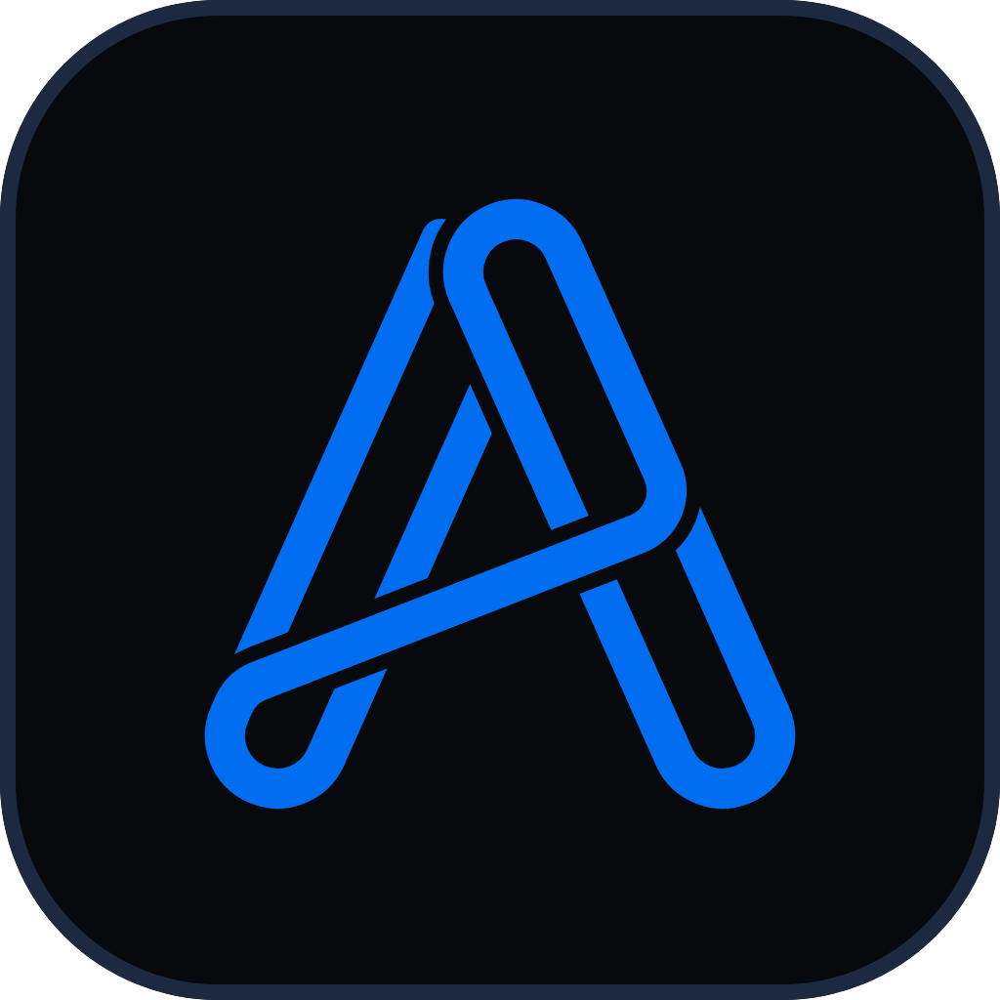

# Flutter Core

<p align="center">
  
</p>

<p align="center">
  <strong>Production-oriented Flutter starter</strong> — Clean Architecture, Riverpod 3,
  auth, networking, adaptive navigation, and bilingual UI — ready to copy into every app.
</p>

<p align="center">
  <a href="https://flutter.dev/"></a>
  <a href="https://dart.dev/"></a>
  <a href="https://riverpod.dev/"></a>
  <a href="https://github.com/Arash3f/nestJs-core-rest"></a>
</p>

---

## Why this exists

Spinning up a Flutter app usually means re-solving the same problems: theme,
locale, secure tokens, HTTP auth refresh, a shell that works on phone and
desktop, and a folder layout that still makes sense six months later.

**Flutter Core** is that baseline. Clone it, rename it, point it at your API,
delete the sample features you do not need.

It is designed to sit next to
[**NestJS Core REST**](https://github.com/Arash3f/nestJs-core-rest) — the same
author’s backend starter (JWT refresh rotation, RBAC, Prisma, OpenAPI). Together
they are a full-stack “core” pair. The Flutter side still speaks plain REST or
GraphQL so you can swap backends without rewriting the UI.

## Highlights

- **Feature-first Clean Architecture** — `presentation → domain ← data`, no
  `Either`; domain `Failure`s + `AsyncValue.guard`
- **Riverpod 3** without code generation — providers declared by hand
- **REST (Dio) and GraphQL** side by side, shared token refresh and error mapper
- **Auth feature** — login, restore, refresh, logout / logout-all, permissions,
  password change, sessions; REST or GraphQL data source
- **go_router** with an auth guard and an adaptive shell (bottom bar / rail)
- **en / fa** localization with RTL, persisted theme and language
- **Arash Alfooneh brand** — Signal Blue palette and Ribbon A mark under
  `assets/brand/`
- **Unit tests** for the network layer, breakpoints and domain use cases
- **Husky + Commitizen (gitmoji)** for consistent commits

## Technology

| Area | Choice |
| --- | --- |
| SDK | Flutter ≥ 3.35, Dart ≥ 3.12 |
| State / DI | Riverpod 3.4 |
| Navigation | go_router |
| REST | Dio 5 |
| GraphQL | graphql_flutter |
| Storage | shared_preferences + flutter_secure_storage |
| Localization | easy_localization (`en`, `fa`) |
| Layout | flutter_screenutil (390×844) + Material 3 breakpoints |
| Desktop | window_manager |

## Companion backend

| | Flutter Core (this repo) | [NestJS Core REST](https://github.com/Arash3f/nestJs-core-rest) |
| --- | --- | --- |
| Role | Mobile / desktop / web client | Production REST API starter |
| Auth | Access + refresh tokens in secure storage | JWT + refresh rotation (Argon2id hash in DB) |
| Errors | `ApiFailure` / `AuthFailure` from JSON body | Normalized `{ statusCode, module, code, message, persianTranslation }` |
| Local default | `http://127.0.0.1:8000` (debug) | `http://localhost:3000` (or Docker `3005`) |

Wire them by pointing `API_BASE_URL` at the Nest server and aligning path names
in `AuthEndpoints` with that API. NestJS Core REST uses camelCase routes such as
`/auth/logIn`, `/auth/refreshToken`, `/auth/changeMyPassword`, `/user/me` — map
those in `auth_remote_data_source.dart` when you connect the two cores.

Until you connect a backend, sign in with the offline demo account
`admin` / `admin` (see [`lib/features/auth`](./lib/features/auth/README.md)), or
run with auth disabled:

```shell
flutter run --dart-define=AUTH_ENABLED=false
```

## Brand

Assets come from the Arash Alfooneh **Ribbon A** logo kit:

| File | Use |
| --- | --- |
| `assets/brand/mark-blue.png` | Primary mark (UI, `AppMark`) |
| `assets/brand/mark-white.png` | Mark on Signal Blue (splash / icons) |
| `assets/brand/app-icon-dark.png` | Marketing / README |
| `assets/brand/lockup-dark.png` | Wordmark lockup |

| Token | Hex |
| --- | --- |
| Signal Blue | `#016DF1` |
| Bright Blue | `#2F8BFF` |
| Ink | `#08090D` |
| Paper | `#F5F7FA` |
| Muted | `#9AA4B2` |
| Line | `#111C2D` |

Rebuild launcher PNGs from the mark, then platform icons:

```shell
dart run tool/gen_icon.dart
dart run flutter_launcher_icons
dart run flutter_native_splash:create
```

## Requirements

| Tool | Version |
| --- | --- |
| Flutter | ≥ 3.35 (stable) |
| Dart | ≥ 3.12 |
| JDK | 17+ (Android) |

## Getting started

```shell
flutter pub get
flutter run                                   # debug → http://127.0.0.1:8000
flutter run --dart-define=AUTH_ENABLED=false  # UI without a backend
```

### Build-time configuration

| `--dart-define` | Default | Purpose |
| --- | --- | --- |
| `API_BASE_URL` | debug `http://127.0.0.1:8000`, release `https://api.example.com` | backend origin |
| `GRAPHQL_PATH` | `/graphql` | GraphQL path |
| `AUTH_ENABLED` | `true` | `false` skips login and the auth guard |

Edit the release URL in `lib/core/utils/constants/api.dart` when a project
starts. On a USB Android phone, either use `adb reverse tcp:8000 tcp:8000` or
pass your LAN IP as `API_BASE_URL`.

## Project layout

```text
lib/
├── main.dart                 bootstrap (storage, locale, desktop window)
├── app.dart                  MaterialApp.router + SplashGate
├── core/
│   ├── error/                Failure + Exception types
│   ├── network/              REST, GraphQL, TokenRefresher, ApiErrorMapper
│   ├── router/               go_router + auth redirect
│   ├── providers/            theme / language
│   ├── widgets/              AdaptiveShell, splash, shared UI
│   └── utils/                colors, theme, storage, l10n, breakpoints, …
└── features/
    ├── auth/                 full Clean Architecture auth example
    ├── profile/              account / password / sessions (uses auth)
    ├── todo/                 local CRUD example
    └── settings/             presentation-only example
test/                         network, breakpoints, use cases
tool/gen_icon.dart            launcher icons from assets/brand
assets/brand/                 Ribbon A mark + marketing art
```

Deep dives:

| Topic | Doc |
| --- | --- |
| Features & Clean Architecture | [`lib/features/README.md`](./lib/features/README.md) |
| Auth | [`lib/features/auth/README.md`](./lib/features/auth/README.md) |
| Network | [`lib/core/network/README.md`](./lib/core/network/README.md) |
| Router | [`lib/core/router/README.md`](./lib/core/router/README.md) |
| Shared widgets | [`lib/core/widgets/README.md`](./lib/core/widgets/README.md) |
| Git hooks | [`readme/GitHooks.md`](./readme/GitHooks.md) |

## Architecture

```text
presentation ──▶ domain ◀── data
```

`domain` is pure Dart. Data sources throw; repositories map to `Failure`;
notifiers use `AsyncValue.guard`. See `lib/features/README.md` for the
step-by-step of adding a feature.

## Commands

### Daily

```shell
flutter pub get
flutter run
flutter devices
flutter clean          # then pub get again if builds act weird
```

### Quality

```shell
dart format lib test tool
flutter analyze
flutter test
```

### Code generation (when needed)

```shell
# after asset changes in pubspec.yaml
dart run build_runner build --delete-conflicting-outputs

# after editing assets/translations/*.json
dart run easy_localization:generate -S assets/translations -O lib/core/utils/l10n -o locale_keys.g.dart -f keys
```

### Platforms

```shell
flutter run -d chrome
flutter run -d windows
flutter build apk --debug
```

### Offline / slow pub.dev

```powershell
$env:PUB_HOSTED_URL = "https://pub.runflare.com"
$env:FLUTTER_STORAGE_BASE_URL = "https://storage.runflare.com"
# or, if packages are already cached:
$env:PUB_CACHE = "$env:LOCALAPPDATA\Pub\Cache"
flutter pub get --offline
```

### Git

```shell
npx cz                 # Commitizen + gitmoji (see .cz-config.js)
```

Pre-commit runs `dart format` and `flutter analyze`. Details:
[`readme/GitHooks.md`](./readme/GitHooks.md).

On Windows, enable **Developer Mode** if `flutter pub get` complains about
symlinks (`start ms-settings:developers`).

## Theming

`TAppTheme.lightTheme` / `darkTheme` compose the per-widget themes under
`core/utils/theme/`. Fonts follow language (IranSans for `fa`, OpenSans
otherwise). Theme mode and language are persisted via `appSettingsProvider`.

Themes are built **inside** `ScreenUtilInit` because text styles use `.sp`.

## License & author

Starter kit by **Arash Alfooneh** — [@Arash3f](https://github.com/Arash3f) ·
[arash-alfooneh.ir](https://arash-alfooneh.ir)

Companion API: [nestJs-core-rest](https://github.com/Arash3f/nestJs-core-rest)
